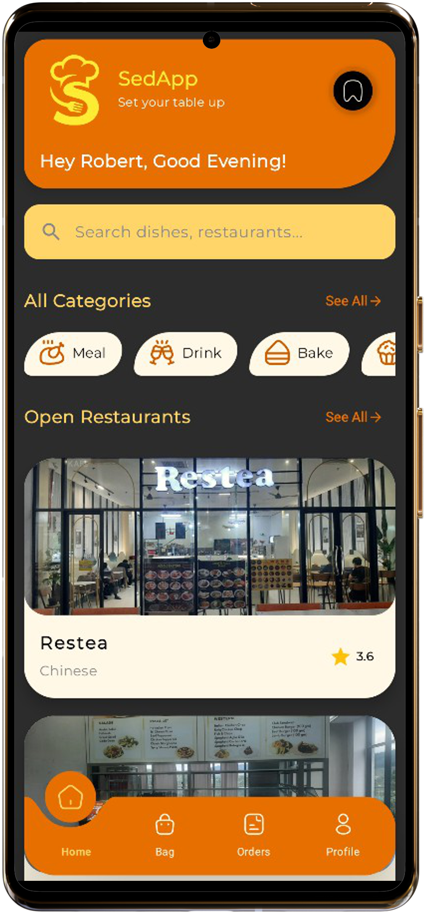
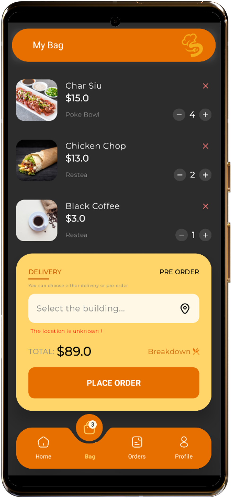
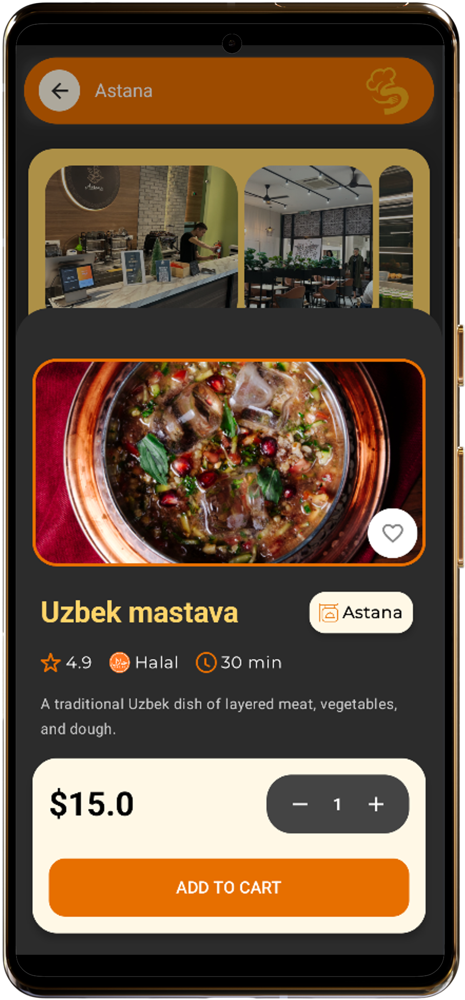

# SedApp – Android Application

SedApp is a modern Android application built with a dark-first design and a scalable architecture. It integrates Firebase Authentication and Cloud Firestore to provide secure user access and real-time data handling.

## 🖼️ Screenshots

    

## ✨ Features

- Firebase Authentication (secure user login,sign up and Google sign in)
- Cloud Firestore (real-time database)
- Modern Material-based UI
- Dark theme with custom color palette
- Clean card-based layout
- Optimized navigation flow

---

## 🧩 Tech Stack

- **Language:** Kotlin  
- **Platform:** Android  
- **UI:** Jetpack Compose  
- **Architecture:** MVVM , Clean Architecture  
- **Backend:** Firebase  
  - Firebase Authentication  
  - Cloud Firestore  
- **Build System:** Gradle  

